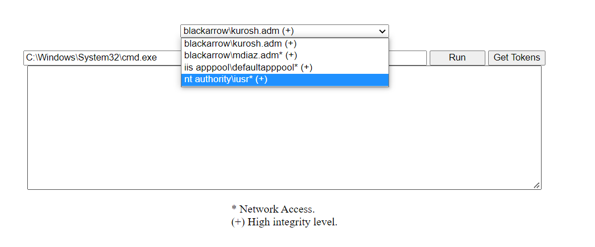

## Summary

ASP.NET web shell to abuse leaked token handles. 

This shell is meant to be used to escape from the Application Pool Identity security context and perform privilege escalation after compromising a web app.



It offers two main functionalities:
* The ```Get Tokens``` button will list all the user tokens available in the w3wp.exe process memory.
* The ```Run``` button executes the specified binary impersonating the selected user token.